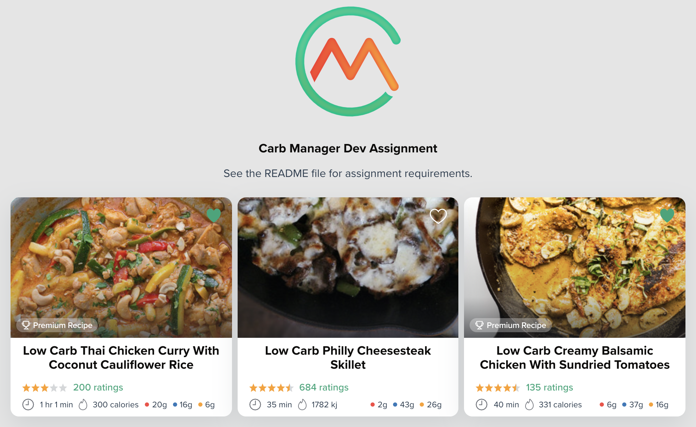

# Carb Manager Dev Assignment

## Design

**Card:**


**Hover:**

20% opacity white fill when hovering over the card.


**Figma Link:**

[https://www.figma.com/file/Hv0bOihxG5M40ASYsFBrVR/Interview-Assignment?node-id=0%3A1](https://www.figma.com/file/Hv0bOihxG5M40ASYsFBrVR/Interview-Assignment?node-id=0%3A1)

---

## Assignment Requirements:

### UI

- Translate the design as closely as possible to custom CSS. We've also provided hover styles for you to replicate.
- Use SVG's for the custom icons. These can be grabbed from the Figma file.
- Make sure the Recipe title gets truncated after 2 lines
- The star ratings should be able to work with half-stars.
- If a recipe duration is longer than 60 minutes, the format should be `x hr x min`
- Add an `energy-units` prop which will take either `calories` (default) or `kilojoules`. This will determine which energy value/unit to display. 1 calorie = 4.184 kJ. The number value passed in as a prop will always represent calories, so if `kilojoules` is selected, a conversion needs to take place.

### Interactions

- The whole card will be clickable. Make sure that the event is working properly. You should see a "clicked" message in the Storybook "actions" tab when clicking on the component.
- Because the whole card is clickable, the "heart" icon in the top right won't be interactive. Instead, it should be empty or filled in depending on a certain prop value.

### Storybook

Create a Storybook story to view the component in isolation and to be able to interact with all available props.

There is a `PremiumRecipeCard.stories.js` placeholder file that you can use to get started. Take a look at the [addon-knobs](https://www.npmjs.com/package/@storybook/addon-knobs) documentation to help you get started if you are unfamiliar with Storybook.

### Tests

There is a `PremiumRecipeCard.spec.js` file which you can use to write some tests. These tests are completely up to you. Try to come up with some useful test cases.

**Hint:** The calorie -> kilojoules conversion will be a good test case to make sure the conversion is working properly.

### Other Notes

- Fork this repo to get started. Please don't create everything with just one commit. We would love to see how you structure your commits.
- Don't feel like you have to stay within the placeholder files. If you want to create some helper/utility functions, go ahead and create the appropriate file/folders for that.
- If you see any elements inside of this Recipe Card design that could be useful to re-use in other areas, feel free to split them out into their own sub components. Don't overengineer it by breaking every single element out, but there might be some that would be better off as small, re-usable components.
- If you do decide to create sub components, bonus points for creating their own stories & tests :)
- Macro dots
  - Red: Carbs
  - Blue: Protein
  - Yellow: Fats
- If you are unclear about something or want to run something by me, please feel free to shoot me an email.

### Reusability

Keep in mind that there may be other variations of the Recipe Card design. Take a look at this **Recipe of the Day** card design:


Don't build out this component (unless you have extra time), but please explain how you would build out this `<RecipeOfTheDay>` component with maximum code re-use from the `<PremiumRecipeCard>`, as they mostly share the same data props with just a tweaked design.

## Project setup

```
yarn install
```

### Compiles and hot-reloads for development

```
yarn serve
```

### Run Storybook

```
yarn storybook
```

### Run your unit tests

```
yarn test:unit
```

## Notes from Jon

Finished application;



### RecipeOfTheDay

Unfortunately I ran out of time and didn't build the `RecipeOfTheDay` component. I focused on building solid foundations rather than rushing to get everything done on time.

The component should be straightforward to build, with minimal alterations;

1.  Create a new presentation component, `RecipeOfTheDay`
2.  'Recipe of the day' sub-title needs a style adding, no need for a new component here
3.  Styles exist already for the recipe title. Only the `font-color` needs changing.
4.  A minor change is required for the `StarRating` component to only show the ratings when provided
5.  No changes required for the preparation time/calories
6.  No changes required for the macro-nutrient bullets
7.  The `PremiumBadge` could be altered to make it more generic and make the icon optional
8.  The card should be fine without a body, no changes needed here (put everything in the head)

That should be all that is required to build this component.

### Reflections

1. I have tried to get as close as possible to the Figma designs. I think I am about 95% of the way there now. I developed using a mobile first approach, with a couple of overrides for larger screen resolutions. Mobile responsiveness is generally working well. I added PostCSS for improved cross browser compatibility and stayed as close to the CSS standard as resonably possible.
2. I used tests to drive the code, from an outside-in (the users) perspective. I didn't concern myself with test coverage, but instead focused on testing the code in a resonable way. I first ran the coverage report whilst writing this README, and found test coverage was well over 96%. I added 1 additional test to get to 100% coverage because the test was valuable.
3. I spent a lot of time developing Storybook stories because I find these incredibly effective when communicating with non-technical project stakeholders and often find it easy to get buy-in when demoing in this manner. I put all component parameters on flags (knobs) to aid interaction. I didn't call `yarn serve` until all development was completed within Storybook. Only minor tweaks were required to get everything working properly.
4. I followed the ITCSS pattern when structuring my CSS and didn't use any local/scope component styles. Not because I don't like them, but because I didn't have much use for them. I prefer to keep local/scoped styles for specific use-cases when the resulting CSS wouldn't need to be re-used elsewhere.
5. My tests are written using [Vue Testing Library](https://testing-library.com/docs/vue-testing-library/intro). These tests are closer to integration tests than unit tests. I don't test the state of the component, only what gets rendered in the browser when state changes (the end result). The exception is the `conversion` code (converting calories to kilojoules). The tests are written as unit tests because this is critical business logic and needs to be accurate.
6. I tried to follow the container/presentation pattern. The heart of the application is `PremiumRecipeCard`, which orchestrates the data and passes it down for presentation, importing helper functions as required.

### What Jon should have mentioned at the interview

1. Huge Keto fan. Was Keto for 3 years. Quit because of complicated reasons that I could discuss in more detail.
2. Once started own Keto blog (KetogenicFamily). Source code is on [Github](https://github.com/jpreecedev/ketogenicfamily/).
3. Knowledgable of Firebase Auth, Firestore, and Messaging, and Functions (Also see [Github](https://github.com/jpreecedev/outsideir35jobs/blob/master/src/app/jobs.service.ts))

Thank you.
